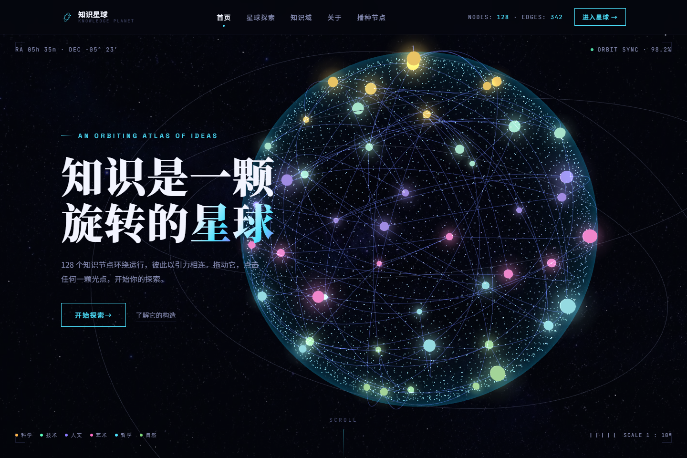

# 旋转知识星球

一个可交互的 3D 知识图谱：128 个来自科学、技术、人文、艺术、哲学与自然的知识节点分布在旋转星球表面。拖动星球、点击光点，即可探索节点详情及关联知识。



## 功能

- 自动旋转且可拖动的 Three.js 知识星球。
- 节点点击、详情抽屉、关联节点跳转与聚焦。
- 六大知识领域浏览、筛选与探索入口。
- WebGL 不可用时自动降级为可点击的静态星球。

## 本地运行

```bash
cd app
npm install
npm run dev
```

执行 `npm run lint` 进行代码检查，执行 `npm run build` 生成生产构建。

## 项目结构

- `app/`：React + TypeScript + Vite 前端应用。
- `app/src/data/nodes.ts`：128 个知识节点与关联关系。
- `docs/home-preview.png`：实际运行后的首页截图。
